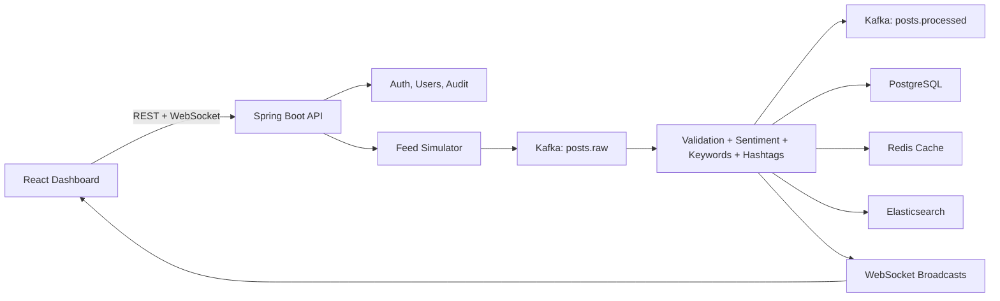

# Real-Time Social Media Analytics Engine

Production-oriented SaaS analytics platform for simulated social media ingestion, Kafka-backed processing, live dashboards, alerting, search, reporting, and administration.

Proprietary and confidential. Unauthorized copying, redistribution, hosting,
or derivative use is prohibited.

## Current Milestone

Milestones 1 through 3 are complete, plus the Part 3 production-readiness foundation:

- Spring Boot backend with authentication, refresh token rotation, user roles, audit logs, feed simulation, post enrichment, dashboard APIs, WebSocket updates, secure headers, explicit CORS, rate limiting, and health checks.
- React / TypeScript / Vite frontend with authenticated flow, dashboard widgets, live WebSocket updates, and production nginx image.
- Docker Compose stack for backend, frontend, PostgreSQL, Kafka, Redis, and Elasticsearch.
- Flyway migrations, focused backend/frontend tests, dependency review, and internal repository governance files.

The milestone plan is tracked in [docs/milestones.md](docs/milestones.md).

## Architecture



Backend modules live under `backend/src/main/java/com/company/socialanalytics` and keep controllers, services, repositories, DTOs, and domain models separated.

## Technology Stack

- Java 21, Spring Boot 3, Spring Security, Spring Data JPA, Flyway, Spring Kafka, Spring WebSocket.
- PostgreSQL, Kafka, Redis, Elasticsearch.
- React 19, TypeScript, Vite, Vitest, Chart.js.
- Docker Compose for local production-like infrastructure.

## macOS Setup

Install local tools:

```bash
brew install openjdk@21 maven node docker
```

Use local Maven for backend work:

```bash
mvn -version
```

Copy environment examples:

```bash
cp .env.example .env
cp backend/.env.example backend/.env
cp frontend/.env.example frontend/.env
```

Fill `DATABASE_PASSWORD` and `JWT_SECRET` in the copied `.env` files before starting the app. Use strong local secrets and never commit real `.env` files.

## Run Locally

Start infrastructure only:

```bash
docker compose -f docker/docker-compose.yml up -d postgres kafka redis elasticsearch
```

Run backend:

```bash
cd backend
mvn -Dmaven.repo.local=../.m2-cache test
mvn spring-boot:run
```

Run frontend:

```bash
cd frontend
npm ci --ignore-scripts
npm rebuild esbuild
npm test
npm run build
npm run dev
```

The frontend runs at [http://localhost:5173](http://localhost:5173). Backend API documentation is available at [http://localhost:8080/swagger-ui.html](http://localhost:8080/swagger-ui.html).

## Docker Setup

Run the full stack:

```bash
cp .env.example .env
# Edit .env and set DATABASE_PASSWORD plus JWT_SECRET before continuing.
docker compose -f docker/docker-compose.yml --env-file .env up --build
```

## API Overview

- `POST /api/v1/auth/register`
- `POST /api/v1/auth/login`
- `POST /api/v1/auth/refresh`
- `POST /api/v1/auth/logout`
- `GET /api/v1/dashboard/summary`
- `GET /ws/dashboard?token=<jwt>`

Additional search, alert, report, notification, and admin endpoints are tracked in the milestone plan.

## Configuration

Important backend environment variables:

- `SPRING_PROFILES_ACTIVE`
- `DATABASE_URL`
- `DATABASE_USERNAME`
- `DATABASE_PASSWORD`
- `KAFKA_BOOTSTRAP_SERVERS`
- `APP_KAFKA_ENABLED`
- `RAW_POST_TOPIC`
- `PROCESSED_POST_TOPIC`
- `REDIS_HOST`
- `ELASTICSEARCH_URIS`
- `JWT_SECRET`
- `CORS_ALLOWED_ORIGINS`
- `WEBSOCKET_ALLOWED_ORIGIN_PATTERNS`
- `LOGIN_RATE_LIMIT`
- `REGISTRATION_RATE_LIMIT`

Profiles:

- `dev`: local developer defaults.
- `test`: isolated test defaults with Kafka disabled.
- `prod`: environment-driven configuration, Flyway enabled, schema validation, and actuator health exposure.

## Screenshots

Screenshots will be added as the dashboard, alert rules, reports, admin panel, and search pages mature.

## Deployment Notes

- Use the `prod` Spring profile.
- Provide secrets through the deployment platform, not committed files.
- Rotate `JWT_SECRET` and database credentials outside source control.
- Keep PostgreSQL, Redis, Kafka, and Elasticsearch on private networks.
- Terminate TLS at a trusted ingress or reverse proxy.
- Restrict CORS and WebSocket origins to deployed frontend origins.
- Run Flyway migrations as part of backend startup or a controlled release job.

## Troubleshooting

- Backend cannot connect to Kafka: check `KAFKA_BOOTSTRAP_SERVERS` and Kafka health in Compose.
- WebSocket closes immediately: verify the access token and `WEBSOCKET_ALLOWED_ORIGIN_PATTERNS`.
- Login/register returns `429`: wait for `RATE_LIMIT_WINDOW` or adjust local rate limits.
- Frontend proxy errors: confirm backend is reachable on `http://localhost:8080`.
- Docker backend fails fast: ensure `.env` defines a strong `JWT_SECRET`.

## Future Improvements

- Alert rule evaluation and notifications.
- Historical search backed by Elasticsearch.
- CSV/PDF reports.
- Admin panel and audit log UI.
- Expanded integration, security, WebSocket, Kafka, Redis, and Docker startup tests.
